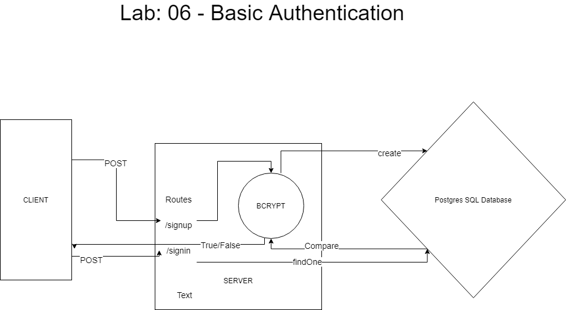

# Lab 06: Authentication

## Description

**Authentication System Phase 1:** Deploy an Express server that implements Basic Authentication, with signup and signin capabilities, using a Postgres database for storage.

## Author

Ayrat Gimranov

## Collaborators

Charlie

## Version

1.0.0

## Resources

Code Feloows 401: JS starter code (Lab06) - <https://github.com/codefellows/seattle-javascript-401n19/tree/main/class-06/lab/starter-code>

## Deployed Sites

Prod branch -- https://ayrat-server-deploy-prod.herokuapp.com/
Dev branch -- https://ayrat-server-deploy-dev.herokuapp.com/

## UML

;
